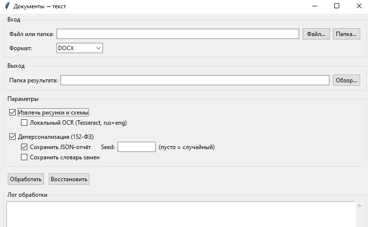
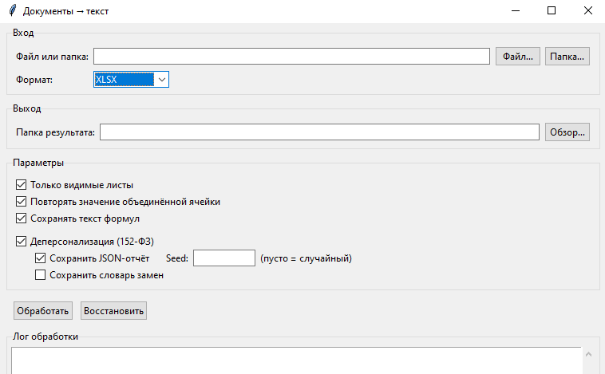
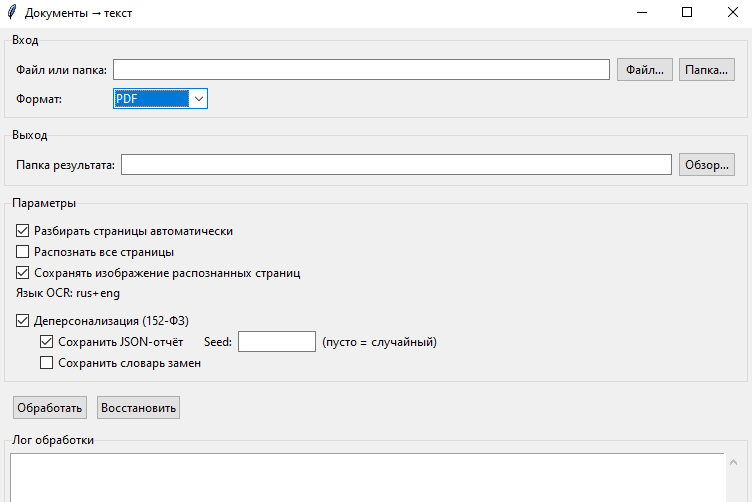

# Документы → текст

Word, Excel и PDF становятся текстом для чтения и разбора + Деперсонализация по 152ФЗ. Исходный файл не меняется.

Готовая программа: [выпуск v3](https://github.com/tb2boris/docxmd/releases/tag/v3), файл `docxmd-3.exe`. Двойной щелчок открывает окно.

## Окно приложения

Ниже скриншоты самого приложения. На каждом снимке окно разбора одного формата: DOCX, XLSX и PDF.







## Что получается на выходе

**DOCX.** Markdown с заголовками, списками и таблицами. По флажку рядом появляется папка `image_<имя>`: в неё попадают рисунки и схемы с подписью или с отсылкой в тексте, а также `images.json`. Иконки и логотипы без такой пометки не выгружаются.

**XLSX.** Короткое оглавление в Markdown, карта `sheets.json` и CSV по каждому видимому листу. Значение объединённой ячейки повторяется по диапазону. Посчитанный результат формулы попадает в CSV, текст формулы — в карту. Скрытый лист в CSV не пишется.

**PDF.** Markdown с заголовком на каждую страницу, карта `pages.json`, рисунки текстовых страниц и картинка листа для сканов. CSV пишется только для таблицы, сетка которой собралась из текстового слоя. Вид страницы определяется сам: обычный текст, скан, буквы кривыми или пустая страница.

Для качественного распознавания сканов и страниц, где буквы нарисованы кривыми, нужна отдельная установка [Tesseract](https://github.com/UB-Mannheim/tesseract/wiki). В exe этой программы нет: окно ищет команду `tesseract` в Path. В установщике отметьте язык Russian, английский уже входит в комплект. Папку `C:\Program Files\Tesseract-OCR` добавьте в Path и проверьте, что `tesseract --list-langs` показывает `rus` и `eng`. Без Tesseract текстовый PDF, Word и Excel собираются как обычно, а скан остаётся картинкой страницы с пометкой в журнале.

Повтор одного и того же имени в папке результата получает суффикс `_2`.

## Деперсонализация

Флажок обрабатывает уже собранный текст ядром по 152-ФЗ: замена выполняется сразу, без режима «только найти». Можно сохранить JSON-отчёт и словарь замен. В отчёте исходные значения только как хеш. Ссылки на картинки не маскируются. У PDF обезличиваются текст и ячейки CSV; сами картинки страниц и вынутые рисунки не закрашиваются.

Ядро лежит в отдельном репозитории [dp152](https://github.com/tb2boris/dp152). В этот репозиторий оно не входит.

Одного клона `docxmd` достаточно, чтобы запустить окно и командную строку и преобразовать Word, Excel и PDF. Флажок деперсонализации при этом не включайте: без ядра программа дойдёт до конвертации и остановится только на замене персональных данных.

Готовый `docxmd-3.exe` из выпуска ядро уже содержит. Отдельный клон `dp152` для двойного щелчка по этому файлу не нужен.

Ядро нужно в двух случаях:

- запуск из исходников с флажком деперсонализации или с `--depersonalize`;
- повторная сборка своего exe командой `python build.py`.

Папка `dp152` должна лежать рядом с папкой `docxmd`, а внутри неё должен быть каталог `src`. Имя соседней папки менять нельзя: программа ищет именно `dp152/src`.

```text
общая_папка/
  docxmd/
  dp152/
    src/
```

Клон `dp152` в другом месте программа не увидит. Если ядро уже скачано не рядом, перед запуском с деперсонализацией можно указать его каталог `src` переменной `DP152_SRC`. На сборку exe эта переменная не действует: `build.py` по-прежнему берёт только соседнюю папку `dp152/src`.

## Запуск из исходников

```powershell
cd src
pip install -r requirements.txt
python gui.py
```

Командная строка:

```powershell
python main.py "C:\docs\регламент.docx" --output "C:\out" --images --ocr --depersonalize --report --seed 42
python main.py "C:\docs\реестр.xlsx" --output "C:\out"
python main.py "C:\docs\приказ.pdf" --output "C:\out"
```

Первая команда включает деперсонализацию, поэтому для неё нужна соседняя папка `dp152`, как описано выше. Вторая и третья команды обходятся одним этим репозиторием.

Для папки укажите `--format docx`, `--format xlsx` или `--format pdf`. У одного файла формат берётся из расширения. Флаги `--images` и `--ocr` относятся к Word. Для PDF распознавание всех страниц включается через `--pdf-force-ocr`, картинки распознанных листов отключаются через `--no-pdf-page-images`.

## Сборка exe

```powershell
cd src
pip install pyinstaller
python build.py
```

Результат сборки — файл `src/dist/docxmd.exe` относительно корня репозитория. Перед запуском `build.py` рядом с папкой `docxmd` уже должен лежать клон [dp152](https://github.com/tb2boris/dp152) с каталогом `src`, как в схеме выше. Без этой соседней папки сборка не стартует. Уже собранный файл из выпуска собирается заново только если нужно изменить программу.
